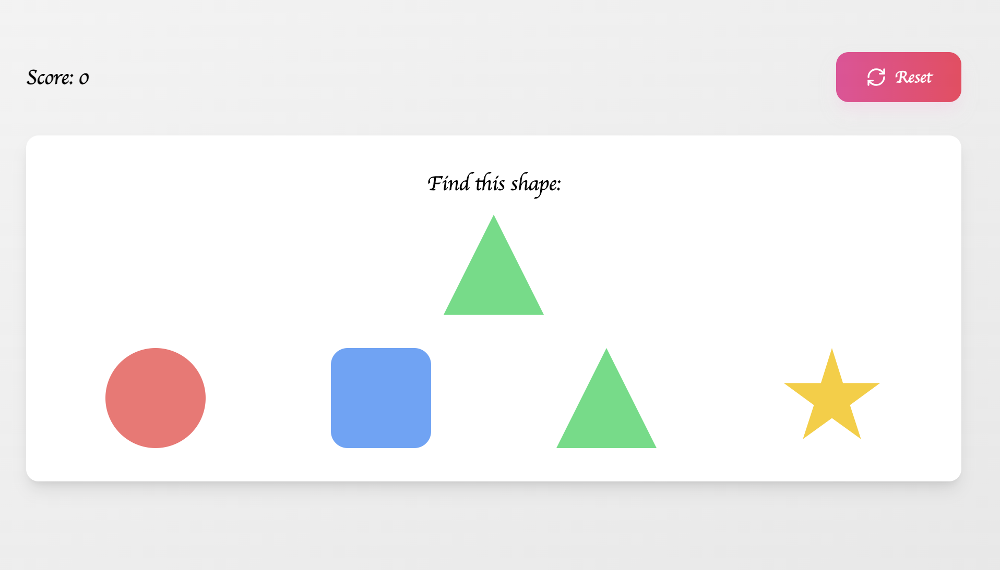

# Educational Games Collection

A React-based web application featuring a collection of interactive educational games designed to make learning fun for children.

## Features

- **Shape Matching Game**: Match shapes and colors to improve visual recognition
- **Animal Habitats**: Learn about animals and their natural environments
- **Number Fun**: Practice number recognition with colorful interactive cards
- Added interactive sound effects or visual feedback when kids complete an action
- Added a Reset Game option.

## Demo

- 
- 
- 
- 

## Tech Stack

- React 18
- TypeScript
- Framer Motion
- Tailwind CSS
- Lucide Icons
- Vite

## Getting Started

1. Clone the repository
2. Install dependencies:
   ```bash
   npm install
   ```
3. Start the development server:
   ```bash
   npm run dev
   ```

## Game Descriptions

### Shape Matching
- Match shapes with their corresponding targets
- Practice visual recognition and memory
- Colorful animations and feedback

### Animal Habitats
- Learn about different animals and their natural environments
- Match animals to their correct habitats
- Beautiful imagery and engaging interactions

### Number Fun
- Practice number recognition
- Interactive number cards with colorful gradients
- Score tracking for progress monitoring

## Development Guidelines

- Component-based architecture for maintainability
- Custom hooks for shared logic
- Framer Motion for smooth animations
- Responsive design for all screen sizes
- TypeScript for type safety
- Utility-first CSS with Tailwind


